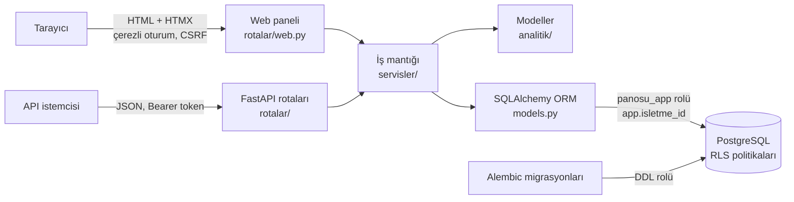

# Ritmeva — Müşteri Zekâ Platformu

Kod ve depo adı: Panosu.

Tekrar eden müşterisi olan işletmeler (pilates/spor stüdyosu, salon, klinik vb.) için **çok kiracılı (multi-tenant) müşteri analitiği**.
Amaç: hangi müşterinin kaybedilmek üzere olduğunu (churn) olasılıksal olarak tahmin etmek, bunu **"Riskteki Para"** olarak göstermek ve her riskli üye için **neden riskli** olduğunu tek cümleyle açıklamak.

## Canlı demo

**Tanıtım videosu (1,5 dk, sentetik veri):**

https://github.com/user-attachments/assets/a7a678b3-f1ee-490c-8329-cbf29dcf5044

Ana adres **https://panosu.onrender.com** tanıtım sayfasıdır. Demo girişi: **https://panosu.onrender.com/giris**

- Giriş formu demo hesabıyla dolu gelir; **Giriş**'e basmanız yeterli. Ardından bir **[DEMO]** işletme seçin; en zengin örnekler **Butik Reformer** ve **Denge Pilates Stüdyosu**.
- Panelde: aylık gelir, gider, kâr ve **başabaş** (kaç aktif üyede kâra geçildiği), **yenilemesi riskli üyeler** (her biri için "neden riskli" açıklaması), **sessiz üyeler** ve yazdırılabilir **haftalık rapor**.
- Veriler sentetiktir; gerçek işletme verisi yoktur. Demo verisi **her gece bugüne kaydırılır**, böylece panel her gün güncel görünür.
- Demo **salt okunurdur**: veri değiştiren istekler `403` döner.
- Ücretsiz sunucu boştayken uyur; ilk açılış **30–60 saniye** sürebilir.

> Durum: Portföy sürümü yayında. Backend, modeller, web paneli, canlı demo, matematik raporu (`docs/matematik-raporu.md`) ve tanıtım videosu tamam. Sıradaki: ilk pilot ile gerçek veride doğrulama.

---

## Öne çıkanlar

- **Veritabanı katmanında kiracı izolasyonu:** Tüm işletmeler tek PostgreSQL veritabanını paylaşır; izolasyon uygulama kodundaki `WHERE` filtrelerine değil, **Row-Level Security (RLS)** politikalarına dayanır. Koddaki bir hata bile başka işletmenin verisini sızdıramaz.
- **En az yetki ilkesi:** Uygulama, RLS'yi atlayamayan ve tablo oluşturamayan kısıtlı `panosu_app` rolüyle bağlanır. Şema değişiklikleri yalnızca ayrı bir DDL rolüyle, Alembic üzerinden yapılır. Üretim modunda uygulama yanlış rolle veya yönetici adresi tanımlıyken açılmayı reddeder.
- **Olasılıksal model, açıklanabilir çıktı:** Yenileme riski MBG/NBD sonsal dağılımlarından kapalı formülle (simülasyon gürültüsü olmadan) hesaplanır; panel, riski "sessizlik" ve "kalan süre / kalan hak" paylarına ayırıp sade bir cümleyle anlatır.
- **Model seçimi kanıtla:** Modeller, gerçek parametreleri bilinen sentetik senaryolarda (S0–S6) ROC AUC ve kalibrasyonla karşılaştırıldı (`docs/backtest-sonuclari.md`).
- **Kiracı bütünlüğü:** Alt tablolar `(isletme_id, x_id)` bileşik yabancı anahtarlarıyla bağlıdır; bir işletmenin ziyareti başka işletmenin müşterisine bağlanamaz.
- **Güvenlik bekçisi testleri:** `create_all()` gibi RLS'siz tablo üretebilecek çağrıları, süper kullanıcıyla bağlanmayı ve rol ayrıcalıklarını otomatik yakalayan testler.
- **Denetim ve KVKK dostu tasarım:** Değişiklikler trigger'larla `denetim_kayitlari` tablosuna yazılır; izni olmayan müşteriye mesaj gönderimi veritabanında engellenir; müşteri anonimleştirme fonksiyonu mevcuttur.
- **Kapsamlı otomatik test paketi:** izolasyon, güvenlik, kimlik doğrulama, API, web paneli, modeller ve veri doğrulama.

---

## Mimari



| Katman | Dosya / klasör | Görev |
|---|---|---|
| Giriş | `main.py` | Uygulamayı, ara katmanları ve rotaları birleştirir |
| Rotalar | `rotalar/` | JSON API uçları; servis hatalarını HTTP kodlarına çevirir |
| Web paneli | `rotalar/web.py`, `sablonlar/web/`, `statik/` | Jinja2 + HTMX paneli; çerezli oturum ve CSRF |
| Ara katman | `rotalar/ara_katman.py` | Salt okunur demo modu, üretim güvenlik başlıkları |
| Doğrulama | `semalar/` | Pydantic v2 istek/yanıt şemaları |
| İş mantığı | `servisler/` | Müşteri, ziyaret, paket, gider, finans, yenileme riski, kimlik ve rapor işlemleri |
| Bağlam | `bagimliliklar.py`, `database.py` | Her işlem başında aktif işletme/kullanıcıyı PostgreSQL'e bildirir |
| Veri modeli | `models.py` | Tabloların ORM karşılıkları (şemanın tek kaynağı SQL'dir) |
| Şema | `faz1_sema.sql`, `alembic/` | Tablolar, RLS, view'lar, trigger'lar, GRANT'lar |
| Modeller | `analitik/` | V1, BG/NBD, MBG/NBD, Gamma-Gamma, yenileme olasılığı (kesin formül), "neden riskli" açıklaması (veritabanı bilmez) |
| Backtest | `backtest/` | Sentetik senaryolarda model karşılaştırması (S0–S6) |
| Sentetik veri | `sentetik/` | BG/NBD tabanlı demo verisi, demo kurulumu ve gece tazelemesi |
| Yayın | `Dockerfile`, `.github/workflows/` | Docker imajı; demo kurulumu ve gece tazelemesi iş akışları |
| Testler | `tests/` | İzolasyon, güvenlik bekçisi, API, web ve birim testleri |

### Veritabanı öne çıkanları
- **Tablolar:** işletmeler, kullanıcılar, üyelikler, müşteriler, hizmetler, ziyaretler, ziyaret kalemleri, müşteri paketleri, işletme giderleri, yenileme riskleri, churn skorları, kampanyalar, mesaj gönderimleri, geri kazanımlar, müşteri izinleri, denetim kayıtları
- **Hazır raporlar (view):** `v_riskteki_para_paneli`, `v_musteri_ozet`, `v_yenileme_paneli`, `v_sessiz_uyeler`, `v_guncel_churn_skorlari` ve diğerleri; hepsi `security_invoker` ile RLS'ye tabidir

### Yayın
Docker imajı **Render**'da (Frankfurt) çalışır; veritabanı **Neon** PostgreSQL'dir (Frankfurt). Demo veritabanı **GitHub Actions** ile kurulur (`demo-kur.yml`, elle tetiklenir) ve her gece 03:00'te (İstanbul) bugüne kaydırılır (`demo-tazele.yml`). Ayrıntılar: `docs/adim-11-tasarim.md`.

---

## Modeller

Ayrıntılı türetmeler, varsayımlar, doğrulama ve bilinen sınırlar **matematik raporunda**: `docs/matematik-raporu.md`. Kısa özet:

**MBG/NBD (Batislam, Denizel & Filiztekin, 2007).** Hayattaki bir müşteri ziyaretlerini Poisson($\lambda$) süreciyle yapar; ilk ziyaret dahil her ziyaretten sonra $p$ olasılıkla bırakır. Müşteriler arası farklılık $\lambda \sim \text{Gamma}(r, \alpha)$ ve $p \sim \text{Beta}(a, b)$ ile modellenir; parametreler her işletmenin kendi verisinden en büyük sonsal (MAP) ile kestirilir: zayıf tanımlanan iki yön ($\kappa = a+b$ ve $r$) zayıf log-normal önselle sabitlenir; ayrıntı `docs/adim-mu-kappa-tasarim.md`. $x$ tekrar ziyaret sayısı, $t_x$ son ziyaretin zamanı, $T$ gözlem süresi olmak üzere:

$$P(\text{hayatta} \mid x, t_x, T) = \left[1 + \frac{a}{b + x}\left(\frac{\alpha + T}{\alpha + t_x}\right)^{r + x}\right]^{-1}$$

**Yenileme olasılığı (kesin formül).** Üye, paketi bittiği anda hâlâ hayattaysa yeniler: $P(\text{yenileme}) = P(\text{hayatta}) \cdot E[(1-p)^K]$; $\lambda$ ve $p$ sonsal dağılımlarından (Gamma ve Beta) gelir, $K$ kalan sürede gelecek ziyaret sayısıdır. Eşlenik önseller sayesinde beklenti kapalı biçimde hesaplanır (hipergeometrik fonksiyon ve negatif binom; Rao-Blackwell'in son hâli, `docs/matematik-raporu.md` Bölüm 5). İlk sürüm aynı değeri 2 000 oynatmalı Monte Carlo ile tahmin ediyordu; sonuçlar aynı, gürültü sıfır. Gerçek yenileme verisiyle henüz kalibre edilmemiştir.

**Riskteki Para.** Bitişine 45 gün (varsayılan) kalan paketler üzerinden:

$$\text{Riskteki Para} = \sum_{\text{paket}} \big(1 - P(\text{yenileme})\big) \times \text{paket fiyatı}$$

**"Neden riskli?" açıklaması.** Yenileme olasılığı iki çarpana ayrılır: $P(\text{yenileme}) = P(\text{şu an aktif}) \times q$, burada $q$ aktifse paketi sürdürme olasılığıdır. Logaritma alınca risk toplamsal iki paya bölünür:

$$-\ln P(\text{yenileme}) = \underbrace{-\ln P(\text{şu an aktif})}_{A:\ \text{sessizlik}} + \underbrace{-\ln q}_{B:\ \text{kalan süre / hak}}$$

$A \ge B$ ise ana neden sessizliktir ("normal aralığının k katı süredir gelmiyor"), değilse paketin kalan süresi veya kalan hakkıdır. Açıklama yalnızca modelin kullandığı bilgiden üretilir.

**Karşılaştırma modelleri.** V1 (kişisel geliş aralığı ~ Normal, risk $= \Phi\big((r-\mu)/\sigma_{\text{etkin}}\big)$), BG/NBD ve basit bir kural ("son 21 günde en fazla 1 giriş"). Sentetik stüdyo senaryosunda (S6) yenileme tahmininde MBG/NBD + yenileme formülü ROC AUC 0.83, kural 0.72 verdi; tüm sonuçlar `docs/backtest-sonuclari.md`'de.

---

## API uçları

Web paneli tarayıcıda `/` adresindedir (çerezli oturum). Aşağıdaki JSON uçlarında kiracı uçları `Authorization: Bearer <erisim_tokeni>` ister; işletme kimliği yalnızca imzalı tokendan okunur.

| Metot | Yol | Açıklama |
|---|---|---|
| `POST` | `/kayit` | Hesap + işletme açma (yalnızca açık kayıt etkinken; aynı e-posta → `409`) |
| `POST` | `/kayit/davet` | Davet koduyla hesap açma (davetteki rolle üye olur) |
| `POST` | `/oturum/giris` | E-posta + parola → token çifti (hatalı → `401`; 5 hatada 15 dk kilit) |
| `POST` | `/oturum/yenile` | Yenileme tokenıyla yeni çift (tek kullanımlık; tekrar kullanımda oturum ailesi iptal) |
| `POST` | `/oturum/cikis` | Oturum ailesini kapatır |
| `POST` | `/oturum/isletme-sec` | Üyesi olunan işletmeyi seçer, yeni erişim tokenı |
| `GET` | `/ben` | Kullanıcı bilgisi ve üyelikler |
| `POST` | `/davetler` | Tek kullanımlık davet kodu (sahip/yönetici; yönetici yalnızca çalışan davet eder) |
| `GET` | `/davetler` | Açık davetler (kod gösterilmez) |
| `POST` | `/davetler/{id}/iptal` | Daveti iptal eder |
| `POST` | `/davetler/kabul` | Giriş yapmış kullanıcı davetle üye olur |
| `GET` | `/uyeler` | İşletmenin üyeleri ve rolleri (sahip/yönetici) |
| `DELETE` | `/uyeler/{kullanici_id}` | Üyeliği siler (sahip; son sahip silinemez) |

| Metot | Yol | Açıklama |
|---|---|---|
| `GET` | `/saglik` | Veritabanı bağlantı kontrolü |
| `POST` | `/musteriler` | Müşteri oluştur (aynı telefon → `409`) |
| `GET` | `/musteriler` | Müşterileri listele / ara |
| `GET` | `/musteriler/{id}` | Müşteri detayı |
| `PATCH` | `/musteriler/{id}` | Müşteri güncelle |
| `DELETE` | `/musteriler/{id}` | Müşteri sil (soft delete) |
| `GET` | `/musteriler/{id}/ozet` | Müşteri özeti: ziyaret sayısı, toplam ciro, ortalama sepet, son 90 gün cirosu |
| `POST` | `/musteriler/{id}/ziyaretler` | Ziyaret kaydet (kalem varsa toplamı sunucu hesaplar) |
| `GET` | `/musteriler/{id}/ziyaretler` | Müşterinin ziyaretleri (yeniden eskiye, sayfalı) |
| `GET` | `/ziyaretler/{id}` | Ziyaret detayı (kalemlerle) |
| `PATCH` | `/ziyaretler/{id}` | Durum, ödeme yöntemi veya not güncelle (tutar ve zaman değişmez) |
| `POST` | `/hizmetler` | Hizmet oluştur (sahip/yönetici; aynı ad → `409`) |
| `GET` | `/hizmetler` | Hizmet kataloğu (`durum=aktif\|pasif\|hepsi`, varsayılan `aktif`) |
| `GET` | `/hizmetler/{id}` | Hizmet detayı |
| `PATCH` | `/hizmetler/{id}` | Hizmet güncelle / pasifleştir (sahip/yönetici; silme yok) |

| Metot | Yol | Açıklama |
|---|---|---|
| `POST` | `/musteriler/{id}/paketler` | Üyelik paketi sat (süre bazlı veya giriş bazlı) |
| `GET` | `/musteriler/{id}/paketler` | Müşterinin paketleri |
| `GET` | `/paketler/{id}` | Paket detayı |
| `PATCH` | `/paketler/{id}` | Paket güncelle |
| `GET` | `/panel/yenilemeler` | Bitişine `gun` gün (varsayılan 45) kalan paketler: yenileme olasılığı ve Riskteki Para |
| `GET` | `/panel/sessiz-uyeler` | Aktif paketi olup şu an aktif olma olasılığı eşiğin (varsayılan 0.5) altında kalan üyeler |
| `GET` | `/panel/finans` | Aylık gelir, gider, kâr ve başabaş (`ay=YYYY-AA`, verilmezse bu ay) |
| `PUT` | `/giderler/{ay}` | Aylık gider kaydet (sahip/yönetici) |
| `GET` | `/giderler/{ay}` | Aylık gider (sahip/yönetici) |
| `GET` | `/rapor/haftalik` | Yazdırılabilir haftalık rapor, HTML (sahip/yönetici) |

Sunucu çalışırken etkileşimli dokümantasyon: `http://127.0.0.1:8000/docs`

---

## Kurulum

**Gereksinimler:** Python 3.14, PostgreSQL 15+

```bash
# 1. Bağımlılıklar
python -m venv .venv
.venv\Scripts\activate          # Linux/macOS: source .venv/bin/activate
pip install -r requirements.txt

# 2. Ayarlar: .env.example dosyasını .env olarak kopyalayıp parolaları doldurun.
#    alembic upgrade head'den önce PANOSU_MIGRASYON_URL (DDL yetkili rol) .env'de tanımlı olmalıdır.

# 3. Veritabanı (baseline migration panosu_app rolünü de oluşturur)
createdb -U postgres panosu
alembic upgrade head
psql -U postgres -d panosu -c "ALTER ROLE panosu_app WITH LOGIN PASSWORD 'parolaniz';"

# 4. Sunucu
uvicorn main:app --reload
```

### Testler
Testler veri ekleyip sildiği için **adı `_test` ile biten ayrı bir veritabanında** çalışır (`panosu_test`, aynı şema kurulu olmalı).
`tests/conftest.py` bağlantı adreslerini `.env`'deki `PANOSU_VERITABANI_URL` ve `PANOSU_MIGRASYON_URL`'den, yalnızca veritabanı adını `panosu_test` yaparak türetir (`PANOSU_TEST_APP_URL` / `PANOSU_TEST_ADMIN_URL` ortam değişkenleri tanımlıysa onlar önceliklidir):

```bash
pytest
```

---

## Sentetik veri ve demo

Gerçek veri gelmeden modelleri sınamak için `sentetik/` paketi, BG/NBD modelinin varsayımlarıyla birebir aynı süreçle veri üretir: her müşterinin gizli geliş hızı (Gamma), her ziyaretten sonra kaybolma olasılığı (Beta) ve harcama eğilimi vardır. Gerçek parametreler bilindiği için modellerin başarısı (ör. ROC AUC) doğrudan ölçülebilir. Stüdyo demoları (Denge Pilates, Butik Reformer) buna üyelik paketlerini ve aylık giderleri ekler.

- Demo verisi ayrı bir veritabanında, `panosu_demo`'da tutulur; canlı veritabanına sentetik veri yazılmaz.
- **`_demo` kilidi:** Yükleyici hedef veritabanını `--veritabani` ile açıkça ister ve adı `_demo` ile bitmiyorsa bağlantı kurmadan durur.
- **Tekrarlanabilir kurulum:** `sentetik.demo_kur`, tüm demoyu sabit tohumlarla baştan kurar; `sentetik.demo_tazele`, tarihleri bugüne kaydırıp riskleri yeniden hesaplar.

```bash
python -m sentetik --sadece-uret                     # veritabanına dokunmadan üret + V1 modelinin ROC AUC'u
python -m sentetik.demo_kur --veritabani panosu_demo # tüm [DEMO] verisini sabit tohumlarla baştan kur (demo parolası ortamdan okunur)
python -m sentetik.demo_sunucu                       # web panelini panosu_demo ile yerelde aç (127.0.0.1:8000)
python -m backtest                                   # model karşılaştırması → docs/backtest-sonuclari.md
```

---

## Yol haritası

Tamamlanan: çok kiracılı şema ve RLS, Alembic, müşteri/hizmet/ziyaret/paket API'si, sentetik veri motoru, model kütüphanesi ve backtest, yenileme riski ve Riskteki Para, finans paneli ve haftalık rapor, gerçek kimlik doğrulama, web paneli, canlı demo, komut satırından CSV içe aktarma, kesin yenileme formülü, matematik raporu ve tanıtım videosu.

Sıradaki (gerçek veri gerektirenler): ilk pilot ile gerçek veride doğrulama, yenileme modelinin gerçek veriyle kalibrasyonu, web üzerinden CSV yükleme, az verili işletmeler için soğuk başlangıç (Bayesçi önsel), izin/mesaj ve geri kazanım ölçümü.

Ayrıntılı yol haritası: `docs/roadmap.md`.

---

## Teknolojiler

Python · FastAPI · SQLAlchemy 2 · Pydantic v2 · Jinja2 · HTMX · PostgreSQL (RLS, PL/pgSQL, view, trigger) · Alembic · NumPy · SciPy · pytest · Docker · Render · Neon · GitHub Actions

## Geliştirici

**Hüseyin Aytekin** — Sakarya Üniversitesi, Matematik
