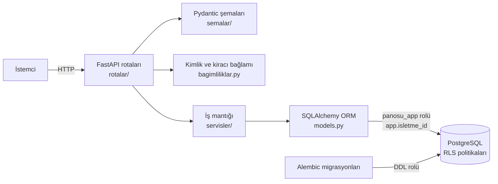

# Panosu — Müşteri Zekâ Platformu

Tekrar eden müşterisi olan işletmeler (salon, spor salonu, klinik vb.) için **çok kiracılı (multi-tenant) müşteri analitiği backend'i**.
Amaç: hangi müşterinin kaybedilmek üzere olduğunu (churn) olasılıksal olarak tahmin etmek ve bunu **"Riskteki Para"** olarak göstermek.

> Durum: **Backend canlıya hazırlanıyor**: çok kiracılı veritabanı ve RLS, müşteri/hizmet/ziyaret/paket API'si, MBG/NBD tabanlı yenileme riski ve Riskteki Para, finans paneli ve haftalık rapor, **gerçek kimlik doğrulama** (Argon2id parola, JWT erişim tokenı, tek kullanımlık yenileme tokenı, davet kodları). Sıradaki: web paneli (Next.js).

---

## Öne çıkanlar

- **Veritabanı katmanında kiracı izolasyonu:** Tüm işletmeler tek PostgreSQL veritabanını paylaşır; izolasyon uygulama kodundaki `WHERE` filtrelerine değil, **Row-Level Security (RLS)** politikalarına dayanır. Koddaki bir hata bile başka işletmenin verisini sızdıramaz.
- **En az yetki ilkesi:** Uygulama, RLS'yi atlayamayan ve tablo oluşturamayan kısıtlı `panosu_app` rolüyle bağlanır. Şema değişiklikleri yalnızca ayrı bir DDL rolüyle, Alembic üzerinden yapılır.
- **Kiracı bütünlüğü:** Alt tablolar `(isletme_id, x_id)` bileşik yabancı anahtarlarıyla bağlıdır; bir işletmenin ziyareti başka işletmenin müşterisine bağlanamaz.
- **Güvenlik bekçisi testleri:** `create_all()` gibi RLS'siz tablo üretebilecek çağrıları, süper kullanıcıyla bağlanmayı ve rol ayrıcalıklarını otomatik yakalayan testler.
- **Denetim ve KVKK dostu tasarım:** Değişiklikler trigger'larla `denetim_kayitlari` tablosuna yazılır; izni olmayan müşteriye mesaj gönderimi veritabanında engellenir; müşteri anonimleştirme fonksiyonu mevcuttur.
- **Kapsamlı otomatik test paketi:** izolasyon, güvenlik, API ve veri doğrulama.

---

## Mimari



| Katman | Dosya / klasör | Görev |
|---|---|---|
| Giriş | `main.py` | Uygulamayı ve rotaları birleştirir |
| Rotalar | `rotalar/` | HTTP uçları; servis hatalarını HTTP kodlarına çevirir |
| Doğrulama | `semalar/` | Pydantic v2 istek/yanıt şemaları |
| İş mantığı | `servisler/` | Müşteri, hizmet ve ziyaret işlemleri; E.164 telefon normalleştirme |
| Bağlam | `bagimliliklar.py`, `database.py` | Her işlem başında aktif işletme/kullanıcıyı PostgreSQL'e bildirir |
| Veri modeli | `models.py` | Kullanıcı, İşletme, Üyelik, Müşteri, Hizmet, Ziyaret, ZiyaretKalemi |
| Şema | `faz1_sema.sql`, `alembic/` | Tablolar, RLS, view'lar, trigger'lar, GRANT'lar |
| Analiz | `MusteriAnalizi.py` | Churn risk modeli (V1 çekirdek) |
| Sentetik veri | `sentetik/` | BG/NBD tabanlı demo verisi üreticisi ve V1 değerlendirmesi |
| Testler | `tests/` | İzolasyon, güvenlik bekçisi, API ve birim testleri |

### Veritabanı öne çıkanları
- **Tablolar:** işletmeler, kullanıcılar, üyelikler, müşteriler, hizmetler, ziyaretler, ziyaret kalemleri, churn skorları, kampanyalar, mesaj gönderimleri, geri kazanımlar, müşteri izinleri, denetim kayıtları
- **Hazır raporlar (view):** `v_riskteki_para_paneli`, `v_musteri_ozet`, `v_guncel_churn_skorlari`, `v_geri_kazanim_ozeti`, `v_musteri_hizmet_dagilimi` — hepsi `security_invoker` ile RLS'ye tabidir

---

## Churn risk modeli (V1)

Her müşterinin ziyaretleri arasındaki gün farklarından kişisel bir **geliş ritmi** çıkarılır:

$$\text{aralık}_i \sim \mathcal{N}(\mu, \sigma^2)$$

Son ziyaretten bu yana geçen gün $r$ ise risk, *"müşterinin şimdiye kadar geri dönmüş olması gerekirken dönmemiş olma"* olasılığıdır:

$$\text{risk} = \Phi\left(\frac{r - \mu}{\sigma_{\text{etkin}}}\right), \qquad \sigma_{\text{etkin}} = \max(\sigma,\; 0.25\,\mu)$$

Taban değer, çok düzenli müşterilerde $\sigma \to 0$ olduğunda riskin ani sıçramasını önler. Risk değeri dört segmente ayrılır: **Güvenli** (< 0.35), **İzlenmeli** (< 0.75), **Yüksek Risk** (< 0.95), **Kritik**.

> Sonraki fazlarda bu model, olasılıksal CLV (BG/NBD + Gamma-Gamma), sağkalım analizi ve makine öğrenmesi modelleriyle karşılaştırılacaktır.

---

## API uçları

Kiracı uçları `Authorization: Bearer <erisim_tokeni>` ister; işletme kimliği yalnızca imzalı tokendan okunur.

| Metot | Yol | Açıklama |
|---|---|---|
| `POST` | `/kayit` | Hesap + işletme açma (yalnızca açık kayıt etkinken; aynı e-posta → `409`) |
| `POST` | `/kayit/davet` | Davet koduyla hesap açma (davetteki rolle üye olur) |
| `POST` | `/oturum/giris` | E-posta + parola → token çifti (hatalı → `401`; 5 hatada 15 dk kilit) |
| `POST` | `/oturum/yenile` | Yenileme tokenıyla yeni çift (tek kullanımlık; tekrar kullanımda oturum ailesi iptal) |
| `POST` | `/oturum/cikis` | Oturum ailesini kapatır |
| `POST` | `/oturum/isletme-sec` | Üyesi olunan işletmeyi seçer, yeni erişim tokenı |
| `GET` | `/ben` | Kullanıcı bilgisi ve üyelikler |
| `POST` | `/davetler` | Tek kullanımlık davet kodu (sahip/yönetici; yönetici yalnızca çalışan davet eder) |
| `GET` | `/davetler` | Açık davetler (kod gösterilmez) |
| `POST` | `/davetler/{id}/iptal` | Daveti iptal eder |
| `POST` | `/davetler/kabul` | Giriş yapmış kullanıcı davetle üye olur |
| `GET` | `/uyeler` | İşletmenin üyeleri ve rolleri (sahip/yönetici) |
| `DELETE` | `/uyeler/{kullanici_id}` | Üyeliği siler (sahip; son sahip silinemez) |

| Metot | Yol | Açıklama |
|---|---|---|
| `GET` | `/saglik` | Veritabanı bağlantı kontrolü |
| `POST` | `/musteriler` | Müşteri oluştur (aynı telefon → `409`) |
| `GET` | `/musteriler` | Müşterileri listele / ara |
| `GET` | `/musteriler/{id}` | Müşteri detayı |
| `PATCH` | `/musteriler/{id}` | Müşteri güncelle |
| `DELETE` | `/musteriler/{id}` | Müşteri sil (soft delete) |
| `GET` | `/musteriler/{id}/ozet` | Müşteri özeti: ziyaret sayısı, toplam ciro, ortalama sepet, son 90 gün cirosu |
| `POST` | `/musteriler/{id}/ziyaretler` | Ziyaret kaydet (kalem varsa toplamı sunucu hesaplar) |
| `GET` | `/musteriler/{id}/ziyaretler` | Müşterinin ziyaretleri (yeniden eskiye, sayfalı) |
| `GET` | `/ziyaretler/{id}` | Ziyaret detayı (kalemlerle) |
| `PATCH` | `/ziyaretler/{id}` | Durum, ödeme yöntemi veya not güncelle (tutar ve zaman değişmez) |
| `POST` | `/hizmetler` | Hizmet oluştur (sahip/yönetici; aynı ad → `409`) |
| `GET` | `/hizmetler` | Hizmet kataloğu (`durum=aktif\|pasif\|hepsi`, varsayılan `aktif`) |
| `GET` | `/hizmetler/{id}` | Hizmet detayı |
| `PATCH` | `/hizmetler/{id}` | Hizmet güncelle / pasifleştir (sahip/yönetici; silme yok) |

Sunucu çalışırken etkileşimli dokümantasyon: `http://127.0.0.1:8000/docs`

---

## Kurulum

**Gereksinimler:** Python 3.12+, PostgreSQL 15+

```bash
# 1. Bağımlılıklar
python -m venv .venv
.venv\Scripts\activate          # Linux/macOS: source .venv/bin/activate
pip install -r requirements.txt

# 2. Ayarlar: .env.example dosyasını .env olarak kopyalayıp parolaları doldurun.
#    alembic upgrade head'den önce PANOSU_MIGRASYON_URL (DDL yetkili rol) .env'de tanımlı olmalıdır.

# 3. Veritabanı (baseline migration panosu_app rolünü de oluşturur)
createdb -U postgres panosu
alembic upgrade head
psql -U postgres -d panosu -c "ALTER ROLE panosu_app WITH LOGIN PASSWORD 'parolaniz';"

# 4. Sunucu
uvicorn main:app --reload
```

### Testler
Testler veri ekleyip sildiği için **adı `_test` ile biten ayrı bir veritabanında** çalışır (`panosu_test`, aynı şema kurulu olmalı).
`tests/conftest.py` bağlantı adreslerini `.env`'deki `PANOSU_VERITABANI_URL` ve `PANOSU_MIGRASYON_URL`'den, yalnızca veritabanı adını `panosu_test` yaparak türetir (`PANOSU_TEST_APP_URL` / `PANOSU_TEST_ADMIN_URL` ortam değişkenleri tanımlıysa onlar önceliklidir):

```bash
pytest
```

---

## Sentetik veri ve demo

Gerçek veri gelmeden modelleri sınamak için `sentetik/` paketi, BG/NBD modelinin varsayımlarıyla birebir aynı süreçle veri üretir: her müşterinin gizli geliş hızı (Gamma), her ziyaretten sonra kaybolma olasılığı (Beta) ve harcama eğilimi vardır. Gerçek parametreler bilindiği için modellerin başarısı (ör. ROC AUC) doğrudan ölçülebilir.

- Demo verisi ayrı bir veritabanında, `panosu_demo`'da tutulur; canlı veritabanına sentetik veri yazılmaz.
- **`_demo` kilidi:** Yükleyici hedef veritabanını `--veritabani` ile açıkça ister ve adı `_demo` ile bitmiyorsa bağlantı kurmadan durur.

```bash
python -m sentetik --sadece-uret                   # veritabanına dokunmadan üret + V1 modelinin ROC AUC'u
python -m sentetik --veritabani panosu_demo        # üret ve panosu_demo'ya yükle
```

---

## Yol haritası

Tamamlanan: çok kiracılı şema ve RLS, Alembic baseline, müşteri/hizmet/ziyaret API'si, sentetik veri motoru.

| # | Adım |
|---|---|
| 5 | Skor motoru v2: BG/NBD + Gamma-Gamma ile Riskteki Para |
| 6 | Backtest: V1 ve BG/NBD'nin sentetik veride karşılaştırılması |
| 7 | Panel API'si: Riskteki Para listesi, işletme özeti |
| 8 | Gerçek kimlik doğrulama ve işletme kaydı (tamamlandı) |
| 9 | Web paneli (Next.js) ve canlı demo |
| 10 | İzin, mesaj ve geri kazanım ölçümü |
| 11 | Yayına alma: Docker, CI, sunucu, ödeme |

Araştırma rafı: RFM/kohort, sağkalım analizi (Kaplan-Meier, Cox), XGBoost + SHAP, kampanya simülatörü / A-B güç analizi.

---

## Teknolojiler

Python · FastAPI · SQLAlchemy 2 · Pydantic v2 · PostgreSQL (RLS, PL/pgSQL, view, trigger) · Alembic · pytest

## Geliştirici

**Hüseyin Aytekin** — Sakarya Üniversitesi, Matematik
